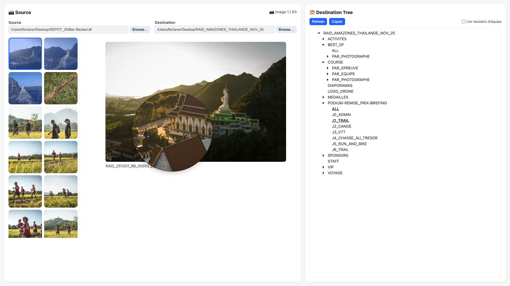

# Folgo

**Folgo** is a lightweight, local-first photo sorting workbench. Built for events where you need to classify hundreds (or thousands) of photos into a predefined folder structure — fast.

Think: 5 photographers, 6 days of racing in Thailand, photos to deliver by team. Folgo replaces the painful macOS Finder workflow (ctrl+click, right-click, alt+copy...) with a clean web UI designed for speed.



---

## What it does

- Browse your source photos as a thumbnail grid
- Preview images with a 5× magnifier
- Multi-select with shift/ctrl/cmd + click, or keyboard navigation
- Navigate your destination folder tree on the right
- Copy selected photos to one or multiple folders in one click
- **Team sync mode**: select all folders with the same name across the tree at once

Everything runs locally. No upload, no account, no subscription.

---

## Install

### Download binary (recommended)

Grab the latest release for your platform from the [Releases page](https://github.com/floriansr/folgo/releases).

Binaries are available for macOS (ARM & Intel), Linux, and Windows.

### Build from source

```bash
git clone https://github.com/floriansr/folgo.git
cd folgo
go build -o folgo ./cmd/folgo
./folgo
```

Requires Go 1.21+.

---

## Usage

```bash
./folgo
# → Folgo running at http://127.0.0.1:8787/workbench-XXXX
```

Open the URL in your browser. Configure your source and destination directories in the settings panel, then start sorting.

**Environment variables:**

| Variable | Default | Description |
|---|---|---|
| `SOURCE_DIR` | `~/Pictures/Source` | Root folder of photos to sort |
| `DEST_ROOT_DIR` | `~/Pictures/Export` | Root of destination folder tree |

---

## Supported formats

`.jpg` `.jpeg` `.png` `.heic` `.tif` `.tiff`

---

## Why not Lightroom / Photo Mechanic / Bridge?

Those tools are great for editing and culling. Folgo solves a different problem: **bulk classification into a pre-existing folder structure**, as fast as possible. No import, no catalog, no sync — just browse and copy.

---

## License

MIT — see [LICENSE](./LICENSE).
